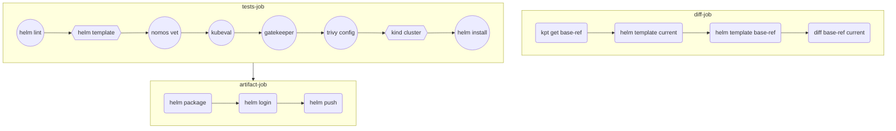
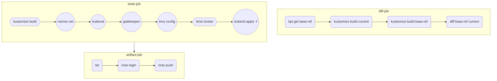

# ci-with-helm

```
.
├── .github
│   └── workflows
│       ├── ci-helm.yaml
│       ├── ci-oras.yaml
├── kustomization.yaml
├── my-chart
│   ├── charts
│   ├── Chart.yaml
│   ├── templates
│   │   ├── deployment.yaml
│   │   ├── _helpers.tpl
│   │   ├── hpa.yaml
│   │   ├── ingress.yaml
│   │   ├── NOTES.txt
│   │   ├── serviceaccount.yaml
│   │   ├── service.yaml
│   │   └── tests
│   └── values.yaml
├── policies
│   ├── k8spspallowedusers.yaml
│   ├── k8spspprivilegedcontainer.yaml
│   ├── psp-pods-allowed-user-ranges.yaml
│   └── psp-privileged-container.yaml
```

## With Helm chart



## With Kustomize


