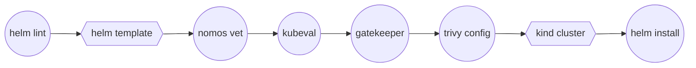

# ci-with-helm

```mermaid
flowchart LR
    lint((helm lint)) --> template{{helm template}}
    template --> vet((nomos vet))
    vet --> kubeval((kubeval))
    kubeval --> gatekeeper((gatekeeper))
    gatekeeper --> trivy((trivy config))
    trivy --> kind{{kind cluster}}
    kind --> install((helm install))
```
