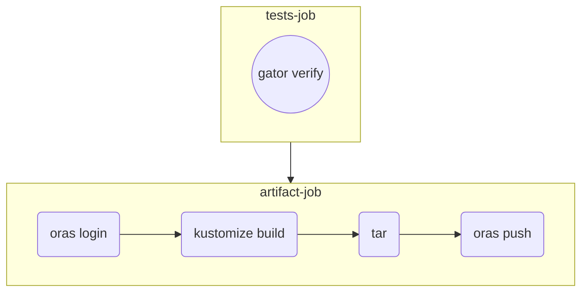
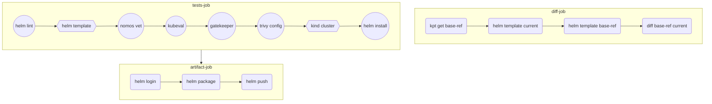
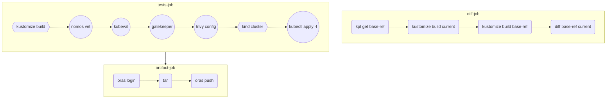

# ci-with-helm

Structure of the folders and files:
```
.
├── docs
├── kustomization.yaml
├── my-chart
│   ├── charts
│   ├── Chart.yaml
│   ├── templates
│   │   ├── deployment.yaml
│   │   ├── _helpers.tpl
│   │   ├── hpa.yaml
│   │   ├── ingress.yaml
│   │   ├── NOTES.txt
│   │   ├── serviceaccount.yaml
│   │   ├── service.yaml
│   │   └── tests
│   └── values.yaml
├── policies
│   ├── kustomization.yaml
│   ├── privileged-containers
│   │   ├── kustomization.yaml
│   │   ├── samples
│   │   │   ├── constraint.yaml
│   │   │   ├── example_allowed.yaml
│   │   │   └── example_disallowed.yaml
│   │   ├── suite.yaml
│   │   └── template.yaml
│   └── users
│       ├── kustomization.yaml
│       ├── samples
│       │   ├── constraint.yaml
│       │   ├── example_allowed.yaml
│       │   └── example_disallowed.yaml
│       ├── suite.yaml
│       └── template.yaml
└── README.md
```

## CI workflow with Gatekeeper policies



## CI workflow with Helm chart



## CI workflow with Kustomize

