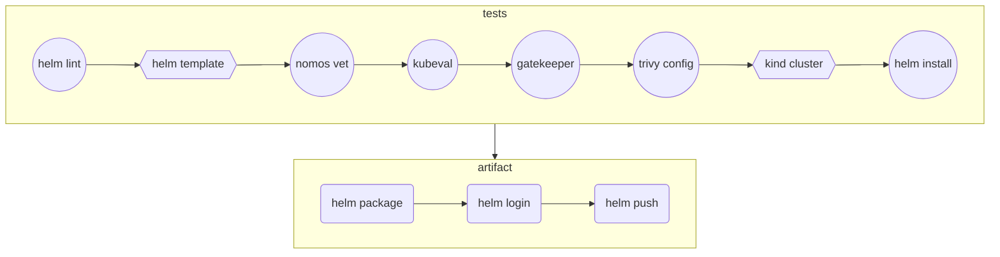

# ci-with-helm

```mermaid
flowchart TB
    subgraph tests
    lint((helm lint)) --> template{{helm template}}
    template --> vet((nomos vet))
    vet --> kubeval((kubeval))
    kubeval --> gatekeeper((gatekeeper))
    gatekeeper --> trivy((trivy config))
    trivy --> kind{{kind cluster}}
    kind --> install((helm install))
    end
    subgraph artifact
    package(helm package) --> login(helm login)
    login --> push(helm push)
    end
    tests --> artifact
```
