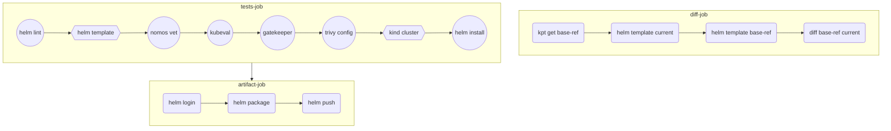

# CI/GitOps with Helm chart demo

CI workflow with Helm chart:

## More resources

- CI/GitOps with Helm, GitHub Actions, and Config Sync
  - [with Google Artifact Registry](https://medium.com/google-cloud/b48604191fda)
  - [with GitHub Container Registry](https://medium.com/google-cloud/836913e74e79)