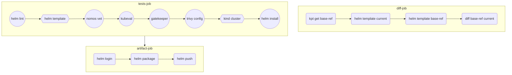

# CI/GitOps with Helm chart demo

CI workflow with Helm chart:


In this repository, the Helm chart has already been pushed in this public GitHub Container Registry.

As prerequisites, you need to have these tools installed:
- [`helm`]()
- [`kubectl`](https://kubernetes.io/docs/tasks/tools/#kubectl)
- [`nomos`]()

Pull this Helm chart locally:
```bash
mkdir tmp
cd tmp
helm pull oci://ghcr.io/mathieu-benoit/my-chart --version 0.1.0 --untar
```

Verify that the Helm chart contains the associated files:
```bash
ls my-chart
```

Deploy this Helm chart with Config Sync (for this part you need to have one of the setups illustrated [here](docs/k8s-cluster-setup.md)):
```bash
cat << EOF | kubectl apply -f -
apiVersion: configsync.gke.io/v1beta1
kind: RootSync
metadata:
  name: root-sync-helm
  namespace: config-management-system
spec:
  spec:
  sourceFormat: unstructured
  sourceType: helm
  helm:
    repo: oci://ghcr.io/mathieu-benoit
    chart: my-chart
    version: 0.1.0
    releaseName: my-chart
    namespace: my-chart
    auth: none
EOF
```

Verify that the OCI artifact has been successfully synced, run `kubectl get rootsync -A`:
```
NAMESPACE                  NAME ...
config-management-system   root-sync-policies ...
```
Check the Config Sync status, run `nomos status --contexts $(k config current-context)`:
```
...
  --------------------
  <root>:root-sync-policies   ghcr.io/mathieu-benoit/policies:0.1.0                              
  SYNCED                      84248a85e7c33b2d860c563f3c8c59b6831fde5bd3ca6aefbd997eba1b86b32d   
  Managed resources:
     NAMESPACE   NAME                                                                           STATUS    SOURCEHASH
                 constrainttemplate.templates.gatekeeper.sh/k8spspallowedusers                  Current   84248a8
                 constrainttemplate.templates.gatekeeper.sh/k8spspprivilegedcontainer           Current   84248a8
                 k8spspallowedusers.constraints.gatekeeper.sh/psp-pods-allowed-user-ranges      Current   84248a8
                 k8spspprivilegedcontainer.constraints.gatekeeper.sh/psp-privileged-container   Current   84248a8
```
Check that the `Constraints` and `ConstraintTemplates` are successfullfy deployed, run `kubectl get constrainttemplates,constraints`:
```
NAME                                                                   AGE
constrainttemplate.templates.gatekeeper.sh/k8spspallowedusers          14m
constrainttemplate.templates.gatekeeper.sh/k8spspprivilegedcontainer   14m

NAME                                                                           ENFORCEMENT-ACTION   TOTAL-VIOLATIONS
k8spspprivilegedcontainer.constraints.gatekeeper.sh/psp-privileged-container                        0

NAME                                                                        ENFORCEMENT-ACTION   TOTAL-VIOLATIONS
k8spspallowedusers.constraints.gatekeeper.sh/psp-pods-allowed-user-ranges                        0
```

(Optional) Cleanup:
```bash
kubectl delete rootsync root-sync-policies -n config-management-system
kubectl delete constrainttemplates --all
kubectl delete constraints --all
rm -r tmp
```

## More resources

- CI/GitOps with Helm, GitHub Actions, and Config Sync
  - [with Google Artifact Registry](https://medium.com/google-cloud/b48604191fda)
  - [with GitHub Container Registry](https://medium.com/google-cloud/836913e74e79)