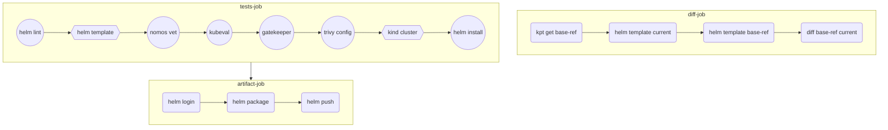

# CI/GitOps with Helm chart demo

CI workflow with Helm chart:


In this repository, the Helm chart has already been pushed in this public GitHub Container Registry.

As prerequisites, you need to have these tools installed:
- [`helm`]()
- [`kubectl`](https://kubernetes.io/docs/tasks/tools/#kubectl)
- [`nomos`]()

Pull this Helm chart locally:
```bash
mkdir tmp
cd tmp
helm pull oci://ghcr.io/mathieu-benoit/my-chart --version 0.1.0 --untar
```

Verify that the Helm chart contains the associated files:
```bash
ls my-chart
```

Deploy this Helm chart with Config Sync (for this part you need to have one of the setups illustrated [here](docs/k8s-cluster-setup.md)):
```bash
cat << EOF | kubectl apply -f -
apiVersion: configsync.gke.io/v1beta1
kind: RootSync
metadata:
  name: root-sync-helm
  namespace: config-management-system
spec:
  spec:
  sourceFormat: unstructured
  sourceType: helm
  helm:
    repo: oci://ghcr.io/mathieu-benoit
    chart: my-chart
    version: 0.1.0
    releaseName: my-chart
    namespace: my-chart
    auth: none
EOF
```

Verify that the Helm chart has been successfully synced, run `kubectl get rootsync -A`:
```
NAMESPACE                  NAME                 RENDERINGCOMMIT...
config-management-system   root-sync-helm       my-chart:0.1.0...
```

Check the Config Sync status, run `nomos status --contexts $(k config current-context)`:
```
...
  --------------------
  <root>:root-sync-helm   N/A              
  SYNCED                  my-chart:0.1.0   
  Managed resources:
     NAMESPACE   NAME                       STATUS    SOURCEHASH
                 namespace/my-chart         Current   my-char
     my-chart    deployment.apps/my-chart   Current   my-char
     my-chart    service/my-chart           Current   my-char
     my-chart    serviceaccount/my-chart    Current   my-char
...
```

Check that the app is successfullfy deployed, run `kubectl get all -n my-chart`:
```
NAME                            READY   STATUS    RESTARTS   AGE
pod/my-chart-787fcd5cbc-kxgkt   1/1     Running   0          5m21s

NAME               TYPE        CLUSTER-IP    EXTERNAL-IP   PORT(S)    AGE
service/my-chart   ClusterIP   10.112.8.71   <none>        8080/TCP   5m23s

NAME                       READY   UP-TO-DATE   AVAILABLE   AGE
deployment.apps/my-chart   1/1     1            1           5m23s

NAME                                  DESIRED   CURRENT   READY   AGE
replicaset.apps/my-chart-787fcd5cbc   1         1         1       5m22s
```

(Optional) Cleanup:
```bash
kubectl delete rootsync root-sync-helm -n config-management-system
kubectl delete ns my-chart
rm -r tmp
```

## More resources

- CI/GitOps with Helm, GitHub Actions, and Config Sync
  - [with Google Artifact Registry](https://medium.com/google-cloud/b48604191fda)
  - [with GitHub Container Registry](https://medium.com/google-cloud/836913e74e79)