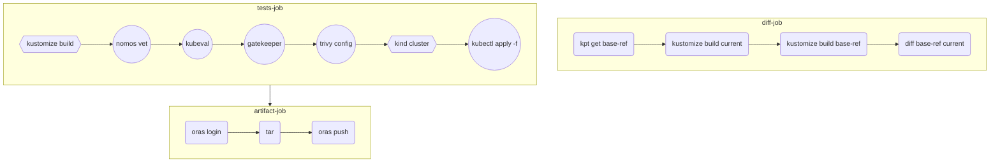

# CI/GitOps with Kustomize overlay as OCI artifact demo

CI workflow with Kustomize overlay:

```mermaid
flowchart TB
    subgraph diff-job
    get(kpt get base-ref) --> build1(kustomize build current)
    build1 --> build2(kustomize build base-ref)
    build2 --> diff(diff base-ref current)
    end
    subgraph tests-job
    hydrate{{kustomize build}} --> vet((nomos vet))
    vet --> kubeval((kubeval))
    kubeval --> gatekeeper((gatekeeper))
    gatekeeper --> trivy((trivy config))
    trivy --> kind{{kind cluster}}
    kind --> deploy((kubectl apply -f))
    end
    subgraph artifact-job
    login(oras login) --> package(tar)
    package --> push(oras push)
    end
    tests-job --> artifact-job
```