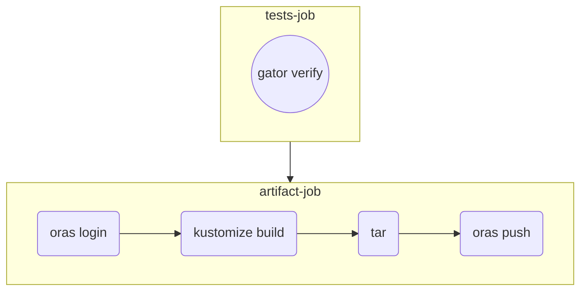

# CI/GitOps with Gatekeeper policies as OCI artifact demo

CI workflow with Gatekeeper policies:


In this repository, the policies have already been pushed in this public GitHub Container Registry.

Pull this OCI artifact locally:
```bash
oras pull ghcr.io/mathieu-benoit/policies:0.1.0
```

(Optional) Verify that the OCI artifact contains the Gatkeeper policies:
```bash
mkdir tmp
cd tmp
tar -xvf policies.tar
cat policies.yaml
```

Deploy this OCI artifact with Config Sync (for this part you need to have one of the setups illustrated [here](docs/k8s-cluster-setup.md)):
```bash
cat << EOF | kubectl apply -f -
apiVersion: configsync.gke.io/v1beta1
kind: RootSync
metadata:
  name: root-sync-policies
  namespace: config-management-system
spec:
  sourceFormat: unstructured
  sourceType: oci
  oci:
    image: ghcr.io/mathieu-benoit/policies:0.1.0
    dir: .
    auth: none
EOF
```

Verify that the OCI artifact has been successfully synced, run `kubectl get rootsync -A`:
```
NAMESPACE                  NAME ...
config-management-system   root-sync-policies ...
```
Check the Config Sync status, run `nomos status --contexts $(k config current-context)`:
```
...
  --------------------
  <root>:root-sync-policies   ghcr.io/mathieu-benoit/policies:0.1.0                              
  SYNCED                      84248a85e7c33b2d860c563f3c8c59b6831fde5bd3ca6aefbd997eba1b86b32d   
  Managed resources:
     NAMESPACE   NAME                                                                           STATUS    SOURCEHASH
                 constrainttemplate.templates.gatekeeper.sh/k8spspallowedusers                  Current   84248a8
                 constrainttemplate.templates.gatekeeper.sh/k8spspprivilegedcontainer           Current   84248a8
                 k8spspallowedusers.constraints.gatekeeper.sh/psp-pods-allowed-user-ranges      Current   84248a8
                 k8spspprivilegedcontainer.constraints.gatekeeper.sh/psp-privileged-container   Current   84248a8
```
Check that the `Constraints` and `ConstraintTemplates` are successfullfy deployed, run `kubectl get constrainttemplates,constraints`:
```
NAME                                                                   AGE
constrainttemplate.templates.gatekeeper.sh/k8spspallowedusers          14m
constrainttemplate.templates.gatekeeper.sh/k8spspprivilegedcontainer   14m

NAME                                                                           ENFORCEMENT-ACTION   TOTAL-VIOLATIONS
k8spspprivilegedcontainer.constraints.gatekeeper.sh/psp-privileged-container                        0

NAME                                                                        ENFORCEMENT-ACTION   TOTAL-VIOLATIONS
k8spspallowedusers.constraints.gatekeeper.sh/psp-pods-allowed-user-ranges                        0
```

(Optional) Cleanup:
```bash
kubectl delete rootsync root-sync-policies -n config-management-system
kubectl delete constrainttemplates,constraints --all
```

## More resources

- [Deploying Gatekeeper policies as OCI artifacts, the GitOps way](https://medium.com/google-cloud/e1233429ae2)